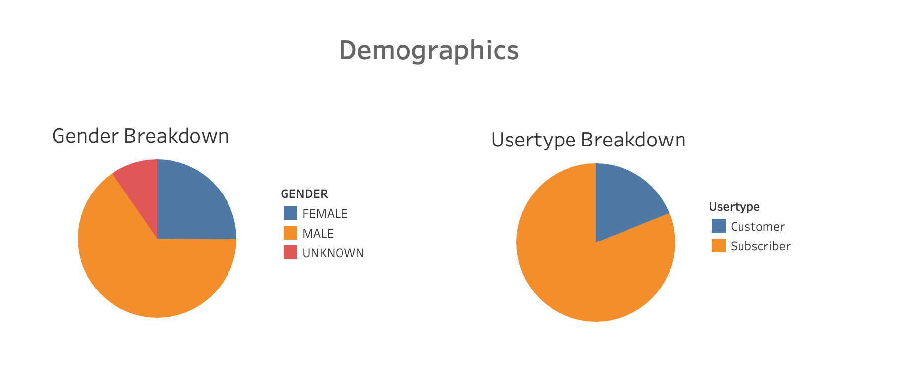
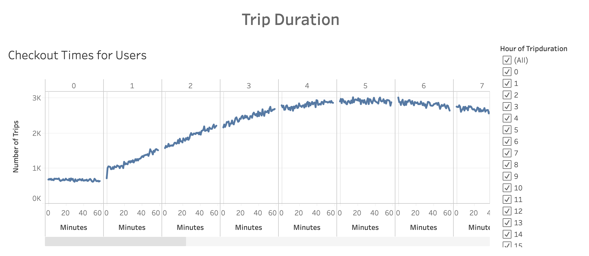
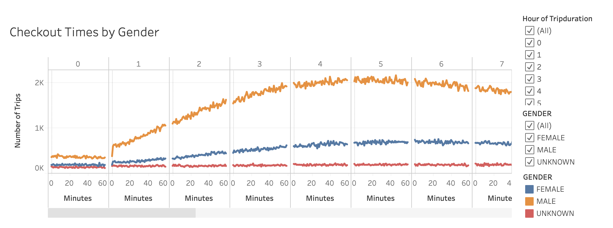
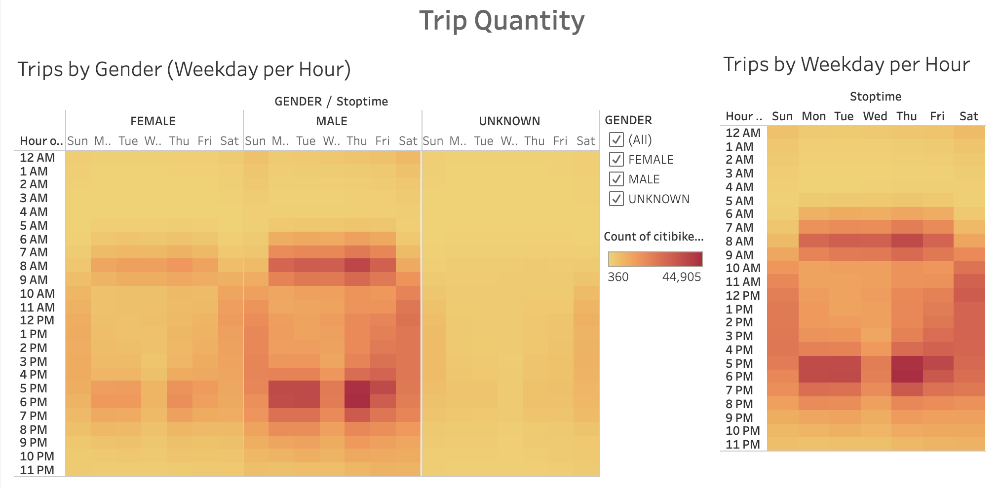
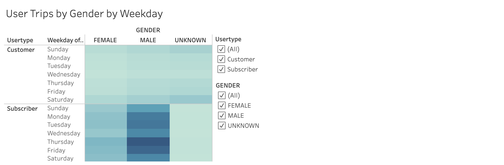

# Bikesharing Analysis

## Overview
The purpose of this analysis is to gather insights from Citi Bike's New York City branch to inform the investment and development of a bikesharing program in Des Moines. To do so, this analysis uses Citi Bike's New York City branch data from August 2018 to outline rider demographic, trip duration, and trip quantity.   

Visuals used for the analysis can be accessed through Tableau Public link here: [link to story](https://us-west-2b.online.tableau.com/t/elisam/views/Bikesharing_Tableau_Challenge_D2/BikeSharingAnalysis/elisasd11@gmail.com/471a6b5e-587f-4cbe-84b6-24a07fed43b4?:display_count=n&:showVizHome=n&:origin=viz_share_link). 

## Results
1. Rider Demographic
1.1. The gender with the highest quantity of bike rides is male with 1,530,272 followed by female and unknown with 588,431 and 225,521, respectively. 
1.2. The user type with the highest quantity of bike rides is subscriber with 1,900,359 followed by customer with 443,865. 

2. Trip Duration
2.1. The trip duration with the highest number of trips is from 5 to 6 hours, and the curve has a left-skewed distribution. 
2.2. Both females and males present a left-skewed distribution; however, the peak for females is from 6 to 7 hours while the peak for males is from 5 to 6 hours. Users with unknown genders are indifferent to trip duration. 

3. Trip Quantity
3.1. Overall, the times with most activity are weekdays from 8:00 am to 9:00 am and from 5:00 pm to 7:00pm -- except Wednesday evenings. 
3.2. Weekends see activity throughout the day from 9:00 am to 8:00 pm. 
3.3. Both males and females ride more bikes weekdays from 8:00 am to 9:00 am and from 5:00 pm to 7:00pm -- except Wednesday evenings. Most males and females fall under the subscriber user type. 
3.4. Users with unknown genders see most activity during weekends and tend to fall under the customer user type. 
3.5. Customer user types under female, male, and unknown genders see most activity during weekends. 
3.6. Subscriber user types under female and male genders see most activity on Thursdays. 

## Summary:
Based on the findings above we can make the following assumptions: 
1. Most users are subscribers and use bikeshare to and from work. To further validate this assumption, starting locations from 5:00 pm to 7:00pm and ending locations from 8:00 am to 9:00 am need to be visualized through a map to see if these locations are near office buldings.  
2. Males use bikeshare twice as much as females. Yet, it may be that there are more males in New York City than females. Additionally, there may be more males working in New York City than females, since we are assuming that most users are using bikeshare to and from work. Two pie chart visualizations would need to be created for further clarity: one for the female and male New York City population split and another for for the female and male New York City employed population split. 
3. Customer user types are less likely than subscriber user types to share their gender and tend to use bikeshare during the weekends. Additional validation is not needed. 
